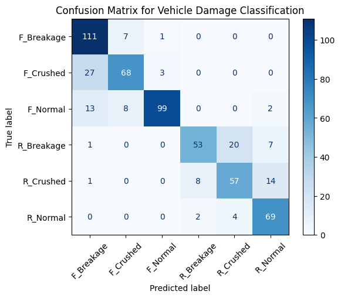

# Vehicle Damage Detection with FastAPI and Transfer Learning

This repository contains a deep learning project for **Vehicle Damage Detection**. The project explores several deep learning models, including custom CNNs, EfficientNet, and ResNet50. Through comprehensive experimentation and evaluation, **ResNet50** with transfer learning techniques was selected for its superior performance. The final model is deployed using a FastAPI-based backend server for real-time predictions.

---

## Table of Contents

1. [Project Overview](#project-overview)
2. [Features](#features)
3. [Dataset](#dataset)
4. [Model Details](#model-details)
5. [Project Structure](#project-structure)
6. [Setup Instructions](#setup-instructions)
7. [Usage](#usage)
8. [Results](#results)
9. [Future Enhancements](#future-enhancements)
10. [Acknowledgements](#acknowledgements)

---

## Project Overview

This project provides a backend server capable of predicting whether a vehicle has damage and categorizing the type of damage. The primary use case includes insurance claim processing, car inspections, and automated damage assessments.

 

---

## Features

- **API Endpoint**: A FastAPI server with a single POST endpoint `/predict` for real-time image classification.
- **Deep Learning**: Uses ResNet50 for transfer learning to achieve high accuracy.
- **Pretrained Model**: A pre-trained ResNet50 model fine-tuned for this task.
- **Real-time Inference**: Efficient image preprocessing and inference pipeline.

---

## Dataset

The model was trained on a dataset of **1725 images**, with six target classes:
1. Front Normal
2. Front Crushed
3. Front Breakage
4. Rear Normal
5. Rear Crushed
6. Rear Breakage

**Data Preprocessing**:
- Images were resized to `224x224 pixels`.
- Augmentation techniques like random flips and rotations were applied to improve generalization.

---

## Model Details

1. **Architecture**:
   - **Base Model**: ResNet50 (transfer learning).
   - Final Fully Connected Layer replaced with:
     ```python
     nn.Sequential(
         nn.Dropout(0.5),
         nn.Linear(self.model.fc.in_features, 6)
     )
     ```

2. **Hyperparameter Tuning**:
   - Learning Rate: `0.005`
   - Dropout Rate: `0.2`

3. **Performance**:
   - **Validation Accuracy**: ~80%

---

## Project Structure

```
Car Damage Prediction/
├── damage_prediction.ipynb      # Main notebook for model development
├── hyperparameter_tunning.ipynb # Notebook for hyperparameter optimization
├── model_helper.py              # Helper functions for model inference
├── server.py                    # FastAPI server implementation
├── saved_model.pth              # Trained model weights
├── README.md                    # Project documentation
├── requirements.txt             # Dependencies list
└── temp_file.jpg                # Example test image
```

---

## Setup Instructions

1. Clone the repository:
   ```bash
   git clone https://github.com/Lezyboi/vehicle-damage-detection.git
   cd vehicle-damage-detection
   ```

2. Install dependencies:
   ```bash
   pip install -r requirements.txt
   ```

3. Start the FastAPI server:
   ```bash
   uvicorn server:app --reload
   ```

4. Access the API at:
   ```
   http://127.0.0.1:8000/docs
   ```

---

## Usage

### API Endpoint
- **URL**: `/predict`
- **Method**: `POST`
- **Input**: Image file (JPEG/PNG format)
- **Output**:
  ```json
  {
      "prediction": "Rear Breakage"
  }
  ```

### Example Python Request
```python
import requests

url = "http://127.0.0.1:8000/predict"
files = {"file": open("car_image.jpg", "rb")}
response = requests.post(url, files=files)
print(response.json())
```

---

## Results

- **Confusion Matrix**: 
 

- **Classification Report**:
  ```
  Precision: 80%
  Recall: 79%
  F1-Score: 79%
  ```

---

## Future Enhancements

1. **Dataset Expansion**:
   - Incorporate additional vehicle damage images to improve generalization.

2. **Deployment**:
   - Host the model on cloud platforms like AWS or Azure for public access.

3. **Frontend**:
   - Develop a user-friendly web interface for image uploads and visual feedback.

4. **Performance Optimization**:
   - Optimize inference speed for real-time applications.

---

## Acknowledgements

- **Codebasics** for the project inspiration and DL course.
- The authors of the **ResNet50** model for the pretrained architecture.

---

